## "a Pattern Language" as a Network

"A Pattern Language" by Christopher Alexander [@alexander1977pattern] is one of the most influential books in urban planning (as well as software development [@beck1987using]). 

The book models architectural and urban design as sets of "design patterns". Each pattern is composed of smaller patterns, and compose larger patterns in return, creating what is essentially a conceptual network of design elements.

Say, for example, we want to design a Seat in a Garden. This has it's own pattern in the book: Pattern *176 Garden Seat*. Each pattern first describes how it fits into the larger patterns that it is part of: 

_"with the character of the garden fixed — *garden growing wild (172)*, we consider the special corners which make the garden valuable and somewhat secret. Of these, the most important is the *sunny place (161)*, which has already been described, because it is so fundamental to the building. Now we add to this another seat, more private, where a person can go to sit and think and dream. [...] see especially *city country fingers (3)* and *quiet backs (59)"*_

It follows a more thorough description of what Alexander thinks makes for a good garden seat (and why it's important). Finally, he lists the patterns that are useful in _constructing_ a garden seat:

_"Place the garden seat, like other outdoor seats, where it commands a view, is in the sun, is sheltered from the wind — *seat spots (241)*; perhaps under bushes and trees where light is soft and dappled — *filtered light (238)*"_


Here are all 253 patterns connected in this way (I higlighted a minimal set of connections needed to keep all chapters connected [@prim1957shortest]):


## On Alexanders' steps to creating your design language

Alexander recommends picking most of the patterns directly related to the pattern one starts from, and after that to keep going as many steps as one wants - each time, "only include the patterns you especially like" [@alexander1977pattern]. He was aware how tightly knit his patterns are ("Your list can easily get too long"). 
The average number of connections per pattern [@diestel2005graph] is 14.77 - some patterns have a lot more connections than that. Here we see that most patterns have around 12 connections, but some have more than 30:
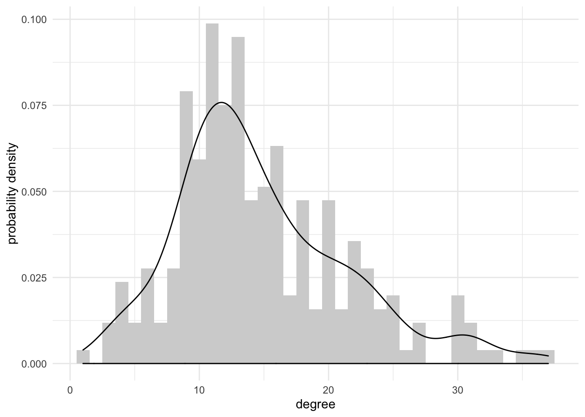

If we move four steps away from the largest pattern "independent regions", 49 out of the 253 patterns are involved. Below we show all patterns involved in "independent regions" if we move 4, 5 and six steps down the hierarchy:

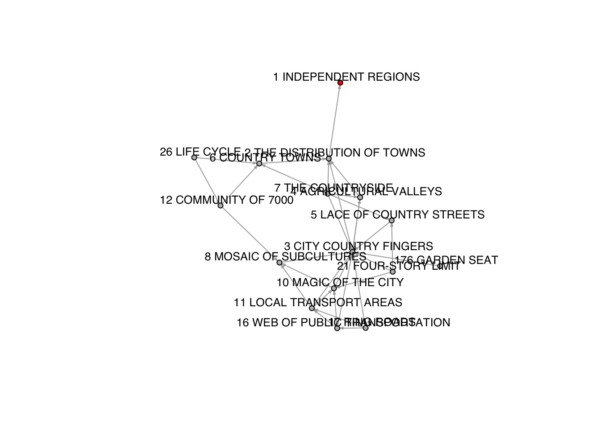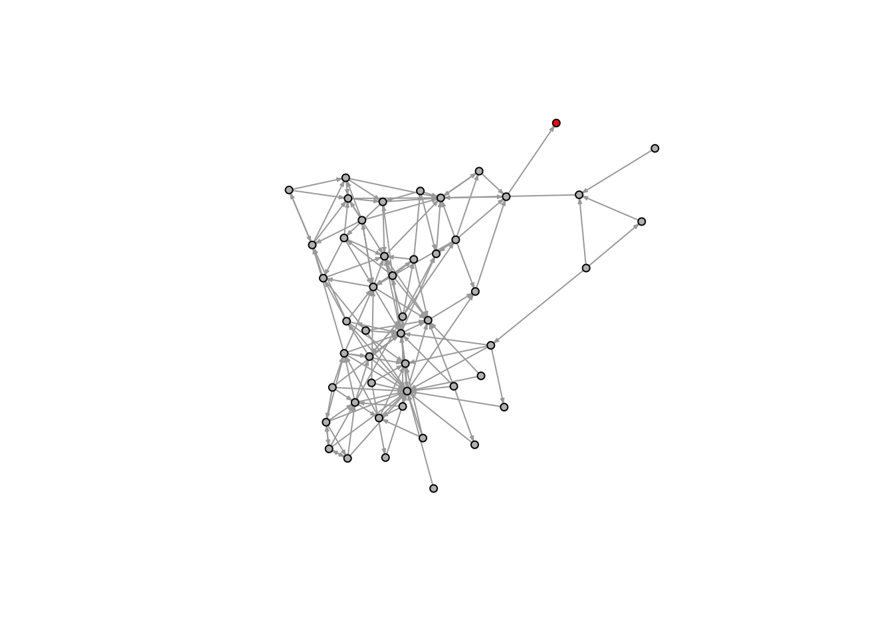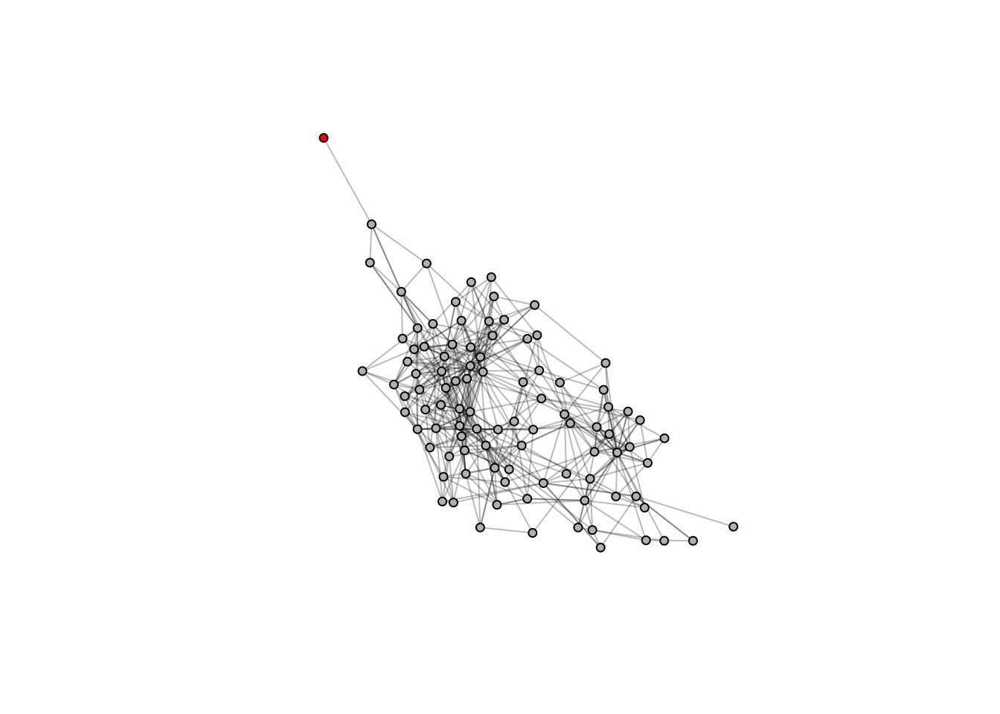

A few steps 'downhill' will quickly give us an opportunity to include almost any of the patterns smaller than the starting point; why then, would we go through the process at all and not just pick freely from the start? This could be hinting at a more deeply rooted issue with Alexander's approach; yes, all the systems and subsystems of the city are interconnected and this complexity should be acknowledged; His attempt to order these connections however ends very close to "everything is connected to everything" - which doesn't help to contextualise and prioritise, and eventually might become subject to whim again.
 
 


## An inconsistent Hierarchy

### Spatial Scales

In this model,  _1 Independent region_ is the "largest" pattern and consists of only one other pattern; the 'distribution of towns':


preservee64a9d2582afdb78

The "distribution of towns" itself is again composed of four other patterns:

- "3 City country fingers"
- "4 Agricultural valleys"
- "6 Country towns"
- "7 The countryside"

These patterns are all _components_ of the pattern "the distribution of towns", which in turn construct the "independent regions":

preserve826d452fda851bf7

This continues all the way down to 'atomic' patterns, that are not constructed of anything else (shown in red):

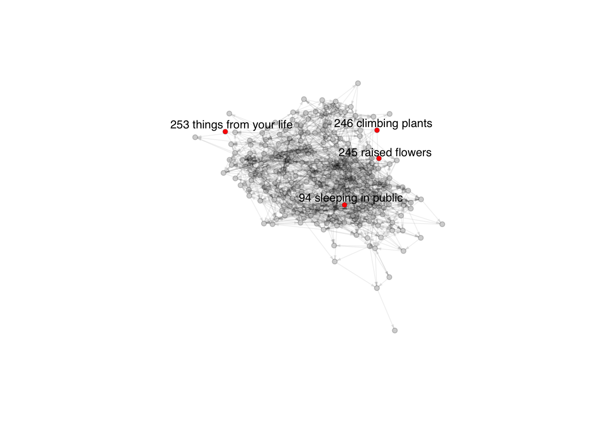

The atomic patterns are _94 sleeping in public, 245 raised flowers, 246 climbing plants, 253 things from your life_. They do not seem to have anything particularily in common - arguably all of these could have been split into smaller patterns or left out if the book wanted to go into more or less detail.

The spatial scales lend an undeniable hierarchy to Alexander's patterns: Independent regions can not be part of Ring Roads, and ring roads can not construct marriage beds. Thus one would expect that we should be able to get hold of a more or less hierarchical structure to the network of patterns, with _1 Independent Regions_ at the top, and very small local things at the bottom:

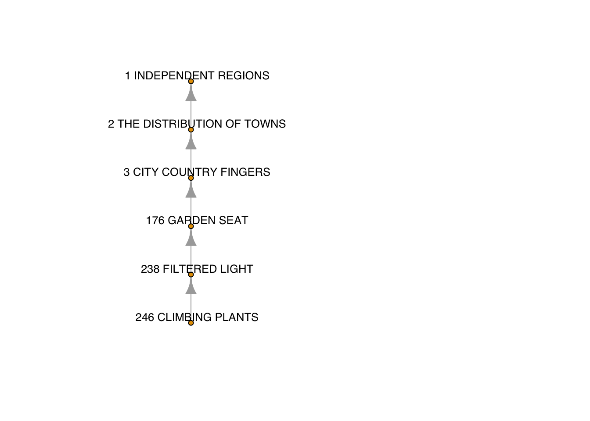


### Deviations

This assumes that a pattern must spatially fit inside another pattern to construct it - e.g. a 'marriage bed' would be smaller than the 'couple's realm' it is part of, and both are smaller than a 'house for a couple'.  One would expect that if A > B, and B > C, then we could also rely on A > C.  A beautiful property of this network is that this is not always the case.

First, hierarchy in spatial scale are fuzzy and not necessarily hold up on a local scale. Without doubt "climbing plants" and "independent regions" are on opposite sides of a spectrum, but whether a garden seat is larger than filtered light is rather philosophical. 

The fuzzines on a local level allows bidirectional (A constucts B and B constructs A) and circular connections:

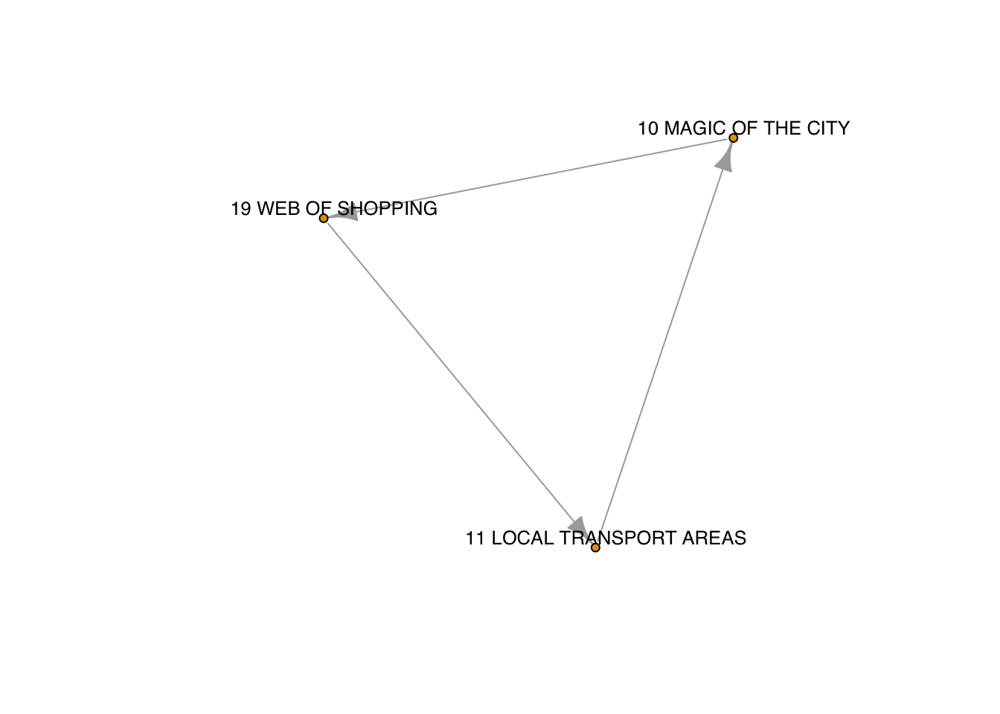

Second, some patterns are very abstract. Take, for example  _10 Magic of the City_ - a lot of things on various scales contribute to it, and there is no obvious reason why it shouldn't be constructed by, or used in the composition of patterns on all scales. Here is the local environment of the pattern 'Magic of the City':

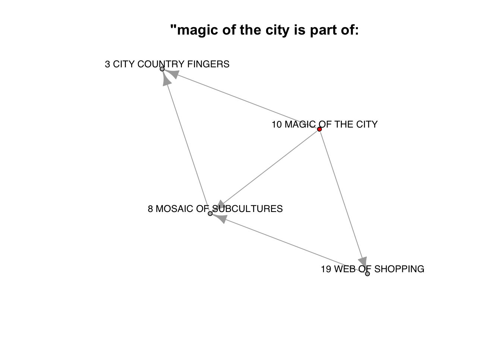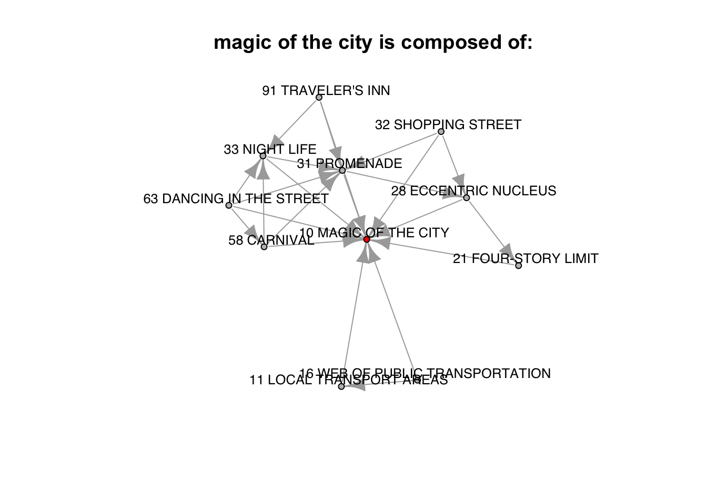


### Fuzzy Hierarchy Graphs 

What we find then is an interesting property of the network: From afar, there is an obvious emergent hierarchy, but in the details, that hierarchy doesn't hold up at all. Is there a way to define where in the hierarchy each pattern lies?


First of all, Alexander did order his chapter numbers roughly according to scale (starting with "independent regions").
A reasonable next step would be to start with the one pattern that we know is at the "top" of the hierarchy - _1 Independent regions_ - and look at how many steps away each other pattern is from it (only going "downhill" in the direction of the links):

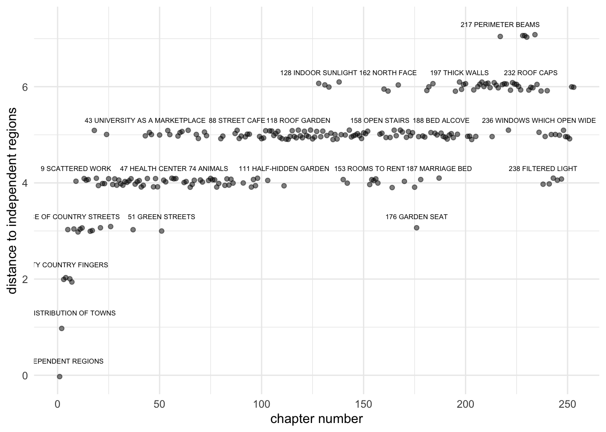

alternatively, we could do the same, but looking at the (average) distance from the atomic patterns:

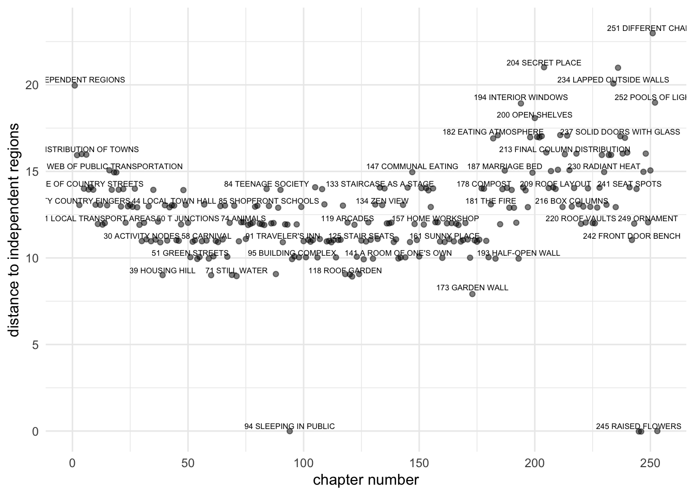

This gives a very different pattern, because _94 Sleeping in public_ appears roughly in the middle of the book, and is connected to a lot of mid-scale patterns. Mainly what this shows though is how sensitive this measure (starting from nodes in the network that have only incoming or outgoing connections, but not both) is to the "edges" of the observed system - Alexander might just as well have not included _94 Sleeping in public", or perhaps included an atomic pattern somewhere else, and the resulting observed hierarchy might would have changed drastically.


Another way to look at this would be to consider the average distance to all nodes "downstream" compared to the average distance to all all nodes "upstream":

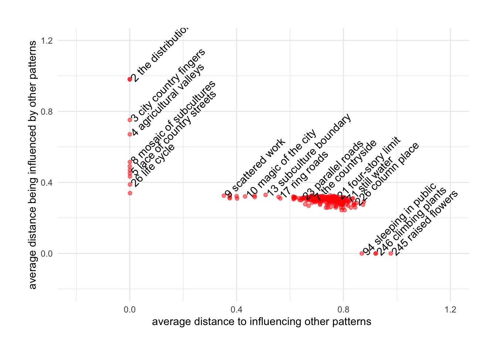

[^1]

[^1]: This is based on the directed closeness centrality


This shows us one large cluster (with stray point to the left), and separate groups: on the left, patterns that do not influence others; they include the patterns influenced most strongly by the other patterns. They are:


-  1 independent regions
-  2 the distribution of towns
-  3 city country fingers
-  4 agricultural valleys
-  5 lace of country streets
-  6 country towns
-  8 mosaic of subcultures
-  12 community of 7000
-  14 identifiable neighborhood
-  26 life cycle
-  27 men and women

The second group, on the bottom, are those that have no pattern constructing them; they are among the closest to influencing other patterns on average; namely:

-  94 sleeping in public
-  245 raised flowers
-  246 climbing plants
-  253 things from your life


Overall I find this interesting as a kind of network that has a fuzzy kind of linear hierarchy. Rather than - as is common - looking at nodes in terms of how "central" they are to the network, there is a vague idea of "upstream" and "downstream" given by the constellation of directed links. One could define some sort of metric for directed networks that would be maximised for nodes connected in a straight line, and minimised for circles or fully connected graphs.

## Data & Code

The data and source code for this article (written with R & RMarkdown) is available [on Github](https://github.com/mabafaba/apatternlanguage)

<!-- This is not a random graph though: -->
<!-- ```{r degree_distribution_randomness, results=FALSE,warning=FALSE,message=FALSE,error=TRUE, out.width=800,in.width=800} -->
<!-- # how often to run simulations? -->
<!-- n.simulations<-10 -->
<!-- # standard devation of degrees: -->
<!-- g_hypothesis_test_scalar_statistic(g,n.simulations,function(g){g %>% degree %>% sd}) %>% g_plot_hypothesis_test(main='degree variance compared to random graph') -->
<!-- # overall closeness of giant component: -->
<!-- g_hypothesis_test_scalar_statistic(g,n.simulations,function(g){g %>% g_subgraph_giant_component %>% closeness %>% mean}) %>% g_plot_hypothesis_test(main='average closeness  compared to random graph') -->
<!-- # in closeness -->
<!-- g_hypothesis_test_scalar_statistic(g,n.simulations,function(g){g %>% g_subgraph_giant_component %>% closeness(mode = 'in') %>% mean}) %>% g_plot_hypothesis_test(main='average IN closeness (compared to randomised graphs)') -->

<!-- g_hypothesis_test_scalar_statistic(g,n.simulations,function(g){g %>% g_subgraph_giant_component %>% closeness(mode = 'out') %>% mean}) %>% -->
<!--  g_plot_hypothesis_test(main='average OUT closeness (compared to randomised graphs)') -->


<!-- ``` -->


<!-- split between costructing patterns / number of patterns constructed - counting the patterns mentioned as contributing to and as constructed by each pattern, the node degree in graph theory [@diestel2005graph] -->


<!-- ```{r degree_in_out, results=FALSE,warning=FALSE,message=FALSE,error=TRUE, out.width=800,in.width=800} -->

<!-- g_plot_vertex_stats_degree_in_out(g) -->

<!-- ``` -->


<!-- The distances between all node pairs: -->
<!-- ```{r distance_matrix, results=FALSE,warning=FALSE,message=FALSE,error=TRUE, out.width=800,in.width=800} -->

<!-- g_plot_distance(g) -->

<!-- ``` -->


<!-- ```{r pagerank, warning=FALSE,messages=FALSE,asis=TRUE} -->

<!-- whole<-g -->


<!-- V(whole)$x<-c(2:length(V(whole))-1,1) # for some reason all is in order except independent region is last. this is a problem with the edge names / vertex names not matching so graph is constructed without vertex list -->


<!-- rank<-page.rank(whole) -->

<!-- V(whole)$y<- page_rank_standardised(whole,"in") -->
<!-- V(whole)$x<- page_rank_standardised(whole,"out") -->
<!-- V(whole)$x<-c(2:253,1) -->
<!-- V(whole)$closeness_ratio<-closeness(whole,vids = V(whole),'in') / closeness(whole,vids = V(whole),'out') -->
<!-- V(whole)$closeness_ratio<-V(whole)$closeness_ratio+min(V(whole)$closeness_ratio)+1 -->
<!-- V(whole)$chapter_number<-c(2:253,1) -->
<!-- V(whole)$closeness_ratio_rank<-order(V(whole)$closeness_ratio,decreasing = T) -->


<!-- V(whole)$closeness_difference<-closeness(whole,vids = V(whole),'in') - closeness(whole,vids = V(whole),'out') -->
<!-- V(whole)$closeness_difference<-V(whole)$closeness_difference+min(V(whole)$closeness_difference)+1 -->
<!-- V(whole)$chapter_number<-c(2:253,1) -->
<!-- V(whole)$closeness_difference_rank<-order(V(whole)$closeness_difference,decreasing = T) -->


<!-- V(whole)$reachable_downstream<-distances(whole,V(g),V(g),mode = 'in') %>% is.finite %>% rowSums -->
<!-- V(whole)$reachable_upstream<-distances(whole,V(g),V(g),mode = 'out') %>% is.finite %>% rowSums -->
<!-- vdf<-igraph::as_data_frame(whole,'vertices') -->

<!-- ggplot(vdf,aes(x=reachable_downstream,y=reachable_upstream))+geom_bin2d(alpha=0.2,binwidth=30)+theme_minimal()+ -->
<!--   scale_color_gradient(low="white",high="black")+ -->
<!--   scale_fill_continuous(type = 'gradient') -->


<!-- # dists<-is.finite(dists) -->
<!-- # dists %>% rowSums -->
<!-- # dists -->
<!-- #  -->
<!-- #  -->
<!-- # dists %>% colnames -->
<!-- # ?shortest.paths -->


<!-- vdf<-igraph::as_data_frame(whole,'vertices') -->
<!-- ggplot(vdf)+geom_segment(aes(x=0,y=chapter_number,xend=1,yend=closeness_ratio_rank)) -->

<!-- ggplot(vdf,aes(chapter_number,closeness_difference_rank))+geom_point(color='grey')+theme_minimal()+geom_text(aes(label=name),size=1,angle=-33)+geom_abline(intercept=253,slope=-1) -->

<!-- ggplot(vdf,aes(chapter_number,closeness_ratio_rank))+geom_point(color='grey')+theme_minimal()+geom_text(aes(label=name),size=1,angle=-33)+scale_y_log10()+geom_abline(intercept=253,slope=-1) -->


<!-- # scale_x_log10() -->
<!-- vertices_w_labels<-V(sub) %>% names %>% sapply(nodeid,g=g) %>% unname -->
<!-- V(whole)$label<-"" -->
<!-- V(whole)$label[vertices_w_labels]<-names(V(whole))[vertices_w_labels] -->

<!-- V(whole)$color<-'#000000AA' -->
<!-- V(whole)$color[vertices_w_labels]<-"#FF0000" -->
<!--     plot.igraph(whole, vertex.size = 4, vertex.label.cex = 0.8,  -->
<!--         vertex.label.dist = 1, vertex.label.family = "sans",edge.color=NA,vertex.frame.color='#000000AA',vertex.label.color='black') -->

<!-- # geom_segment() -->

<!-- ``` -->


<!-- ```{r} -->

<!-- ``` -->


<!-- ```{r interactive_net, warning=FALSE,messages=FALSE} -->


<!-- ``` -->


<!-- ```{r js, results='asis',echo=FALSE} -->
<!-- js<-function(jscode){ -->
<!-- open<-"<script>" -->
<!-- close<-"</script>" -->
<!-- paste(open,jscode,close,collapse='\n') -->
<!-- } -->
<!-- css<-function(css){ -->
<!-- open<-"<style>" -->
<!-- close<-"</style>" -->
<!-- paste(open,css,close,collapse='\n') -->
<!-- } -->


<!-- css(' -->
<!-- .nodetext{font:12px sans-serif !important;} -->
<!-- .main-container{ -->

<!-- } -->
<!--     ') %>% cat -->
<!-- js("console.log('TESTTESTTEST')") %>% cat -->

<!-- ``` -->


## References

